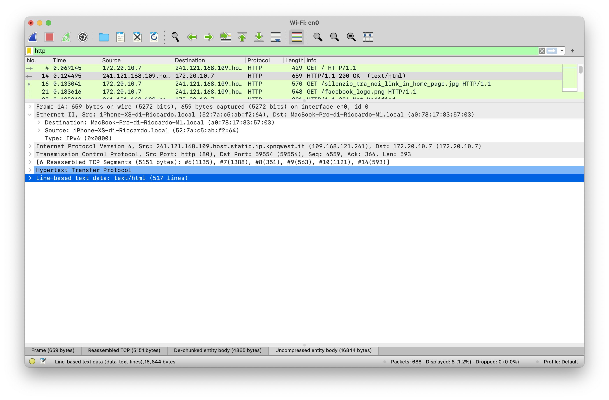
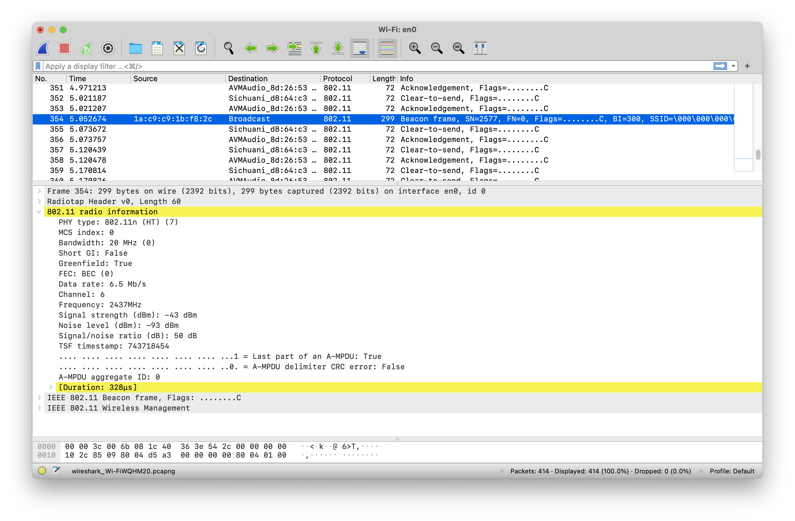
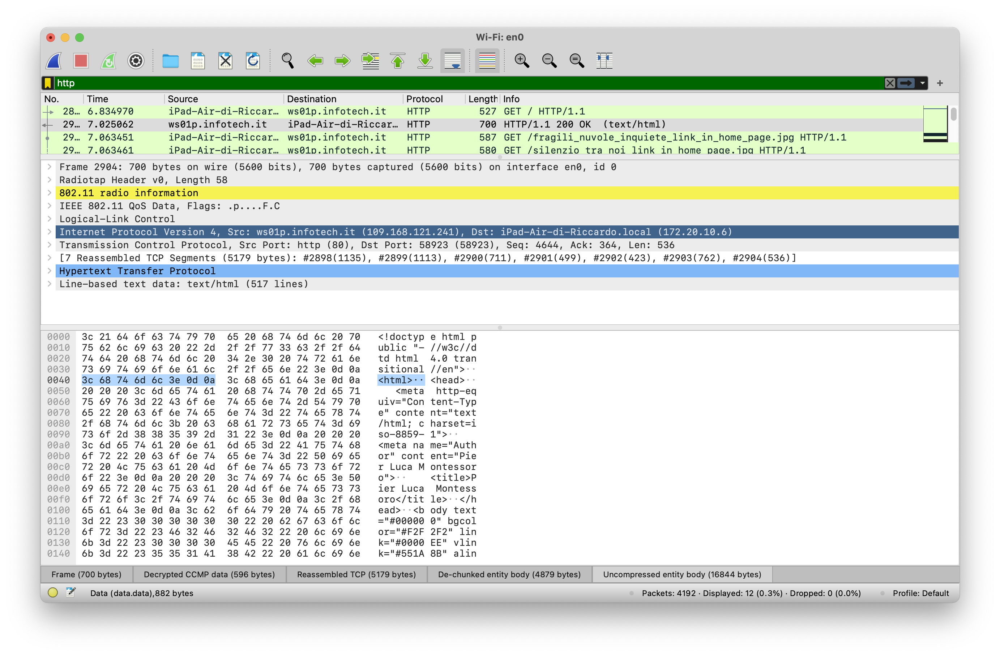

# Attivazione di Wirehark

Si verifica mendiante il comando `ifconfig` la configurazione di rete dell'host. Tra le molte interfacce indicate, si trova che quella attualmente in considerazione (scheda 802.11 a/b/g/n/ac/ax integrata nel computer portatile) corrisponde all'interfaccia `en0`.

```zsh
riccardo@MBP-M1 ~ % ifconfig

...

en0: flags=8863<UP,BROADCAST,SMART,RUNNING,SIMPLEX,MULTICAST> mtu 1500
	options=400<CHANNEL_IO>
	ether a0:78:17:83:57:03
	inet6 fe80::10b2:945:6846:62c4%en0 prefixlen 64 secured scopeid 0xc
	inet 172.20.10.7 netmask 0xfffffff0 broadcast 172.20.10.15
	nd6 options=201<PERFORMNUD,DAD>
	media: autoselect
	status: active

...
...
...
~
```

L'indirizzo MAC dell'interfaccia è `A0:78:17:83:57:03`, mentre l'indirizzo IP corrisponde a `172.20.10.7`. Per trovare l'indirizzo del default gateway si ricorre ad un altro comando:

```sh
riccardo@MBP-M1 ~ % route get default

   route to: default
destination: default
       mask: default
    gateway: 172.20.10.1
  interface: en0
      flags: <UP,GATEWAY,DONE,STATIC,PRCLONING,GLOBAL>

...

~
```

Si scopre così che per `en0` il default gateway ha come indirizzo IP locale `172.20.10.1` (attualmente un telefono cellulare utilizzato come access point).

# Analisi indirizzi MAC

Questa analisi è stata effettuata in precedenza, su una rete diversa da quella indicata nella prima parte di esercitazione. Si è scelto di usare una vecchia analisi in quanto il traffico singlecast sulla rete generata dal telefono cellulare come access point si è rivelato piuttosto scarno, essendo composto da soli due dispositivi.

Avviando una cattura con Wireshark (senza generare traffico di proposito) si notano comunque una moltitudine di pacchetti di vario tipo. Tutti i pacchetti riportano indirizzi MAC singlecast.

Si riportano in tabella alcuni dei protocolli ed i nomi dei produttori delle relative schede di rete rilevati in questa sessione (solo indirizzi singlecast, il produttore si riferisce alla scheda di rete di destinazione).

| Protocollo | Costruttore scheda di rete e dettagli                             |
| ---------- | ----------------------------------------------------------------- |
| UDP        | Gemtek (access point)                                             |
| IGMPv2     | Gemtek (antenna FWA, default gateway)                             |
| MDNS       | Sconosciuto (`F6:6B:E9`, probabilmente un indirizzo randomizzato) |
| MDNS       | Texas Instruments (dispositivo IoT)                               |
| TCP        | Rigol Technologies (oscilloscopio, probabilmente per LXI)         |
| STUN       | Apple, Inc. (tablet, STUN sfruttato da FaceTime, software VoIP)   |
| TLSv1      | Gemtek (antenna FWA, default gateway)                             |

Si esegue il comando `ping` per forzare la trasmissione di pacchetti broadcast.
Questo comporta la comparsa di vari pacchetti broadcast con protocollo ARP (Address Resolution Protocol) in Wireshark. L'indirizzo MAC dei pacchetti broadcast è `FF:FF:FF:FF:FF:FF`.

# Imbustamento multiplo

## Introduzione

Per la parte finale di questa esercitazione, si desidera ottenere una visione d'insieme di tutti gli imbustamenti effettuati per caricare una pagina web mentre si è connessi ad una rete 802.11ac. Non essendo momentaneamente possibile ricorrere ad un collegamento Ethernet cablato, occorrerà utilizzare delle tecniche di sniffing per poter effettuare questa analisi su rete wireless.

<!-- Si include anche una breve analisi di una piccola scoperta avvenuta durante questa prova. -->

Visto che attivare la modalità monitor su una scheda di rete wireless ne comporta la disconnessione dalla rete, si opererà nel modo seguente:

- Il computer con il software di cattura del traffico viene utilizzato come sniffer. Data la presenza di una sola scheda di rete wireless integrata, questo dispositivo sarà dedicato soltanto all'analisi del traffico, e non alla sua generazione.
- Un telefono cellulare è configurato come access point ("hotspot"). La rete generata è protetta da password, ma questa è conosciuta.
- Un altro dispositivo mobile (tablet) è connesso all'access point. Ad un certo punto si visiterà la home page di montessoro.it e si cercherà di catturarne la sua trasmissione mediante Wireshark. Se questo sarà opportunamente configurato, si potrà vedere l'imbustamento completo dei dati contenuti nella pagina.

*(Si riporta la procedura di attivazione ed uso della monitor mode, in maniera simile a quanto indicato sul forum di e-learning, concentrandosi soltanto sul sistema operativo effettivamente utilizzato).*

## La *monitor mode*

Si è notato che effettuando una cattura del traffico 802.11 in *managed mode* si perdono molte informazioni sul protocollo 802.11. Questo avviene in quanto viene presentata una "finta" interfaccia di rete Ethernet al posto di 802.11. Ciò comporta la perdita delle informazioni sulla configurazione del livello fisico e del Logical Link Control. L'header mostrato in questa configurazione riporta soltanto gli indirizzi MAC di partenza e destinazione, come mostrato in figura \ref{fig:01}.



Nonostante non si sia in grado di analizzare gli header del protocollo 802.11ac, si vuole effettuare questa analisi avanzata in modo di avere un quadro generale degli imbustamenti effettuati. Inoltre, un'analisi di tutto ciò che sta al di sopra del livello 3 è tranquillamente fattibile anche in *managed mode* e si ripete che questa prova è effettuata soltanto per completezza.

Guardando tra gli strumenti offerti dal sistema in uso (macOS 11.4), si scopre una utility di diagnosi wireless facente uso della *monitor mode*.
Simili utility sembrano essere presente su tutti i computer dotati di schede di rete wireless, ma non tutti sembrano supportare l'attivazione della *monitor mode* da parte dell'utente. In particolare, questa procedura non sembra funzionare su un computer portatile dello stesso tipo, ma risalente a circa 10 anni fa, indipendentemente dalla versione del sistema operativo utilizzato. Si suppone che possa essere una limitazione hardware.

Si tenta di avviare la procedura di commutazione della modalità della scheda 802.11. Si fa riferimento a quanto indicato [in questa spiegazione](https://unix.stackexchange.com/questions/48671/how-to-put-mac-os-x-wireless-adapter-in-monitor-mode).

```zsh
riccardo@MBP-M1 ~ % airport en0 sniff
```

Osservando l'icona della ricezione del segnale Wi-Fi, si nota che la commutazione è avvenuta con successo. Non è possibile connettersi a nessuna rete 802.11. Inoltre, il terminale risulta occupato dal comando eseguito, e non appena lo si termina con `Ctrl-C`, l'interfaccia `en0` torna in modalità normale (*managed*).

## Decrittografia di reti protette

Si procede con la [configurazione di Wireshark](https://wiki.wireshark.org/HowToDecrypt802.11) in modo tale che possa decodificare il traffico 802.11 crittato mediante protezione WPA2. Si fornisce a Wireshark una lista di coppie rete-passphrase con cui possa provare a decrittare il traffico catturato. Quando Wireshark riesce a decodificare un pacchetto, nella lista apparirà colorato, a differenza dei pacchetti delle reti sconosciute, che restano bianchi (non decodificati).

<!-- ## Imprevisto

Provando ad avviare una cattura mentre si utilizza il dispositivo connesso all'access point per navigare su Internet, si nota che tutti i pacchetti elencati in Wireshark restano bianchi, non decodificati (figura \ref{fig:02}). Dopo aver verificato di aver inserito correttamente le credenziali della rete, si giunge a conclusione che la decodifica non sta funzionando correttamente. Si decide di riconfigurare l'access point dalle impostazioni del cellulare. Si riesce ad effettuare una sessione di cattura con successo, ma le successive falliscono tutte.



Ci si è imbattuti in una prima problematica. Assumendo che il sistema di decodifica funziona con le credenziali attualmente inserite (visto il successo a seguito del cambio di credenziali dalle impostazioni dell'hotspot cellulare), si giunge a conclusione che la passphrase della rete venga cambiata arbitrariamente a seguito della prima connessione.

## Breve analisi del sistema scoperto

Accidentalmente, si è scoperto un meccanismo di protezione dell'hotspot personale implementato in iOS. Quando si avvia l'access point manualmente, entrando nelle impostazioni del telefono cellulare e spostando l'interruttore in posizione accesa, questo genera una rete 802.11 accessibile da chiunque mediante la passphrase scelta ed inserita dall'utente.

Nel sistema operativo iOS esiste una funzionalità chiamata "Instant hotspot", che consente ad un dispositivo non dotato di connessione LTE (come un tablet) di sfruttare la connessione mobile di un telefono cellulare nei dintorni, a patto che questo sia appartenente al suo stesso proprietario. Questa funzionalità consente di cominciare a navigare automaticamente non appena si apre un browser o un qualsiasi software richiedente accesso ad Internet, senza la necessità di interagire con il telefono cellulare.

Il dispositivo richiedente l'accesso ad internet annuncia al telefono cellulare, utilizzando una connessione Bluetooth LE, la necessità di usufruire del servizio di access point su rete mobile. Dato che questa modalità sarebbe intesa per un uso strettamente personale, è necessario inibire l'accesso alla rete ad eventuali dispositivi di proprietà altrui dotati della chiave solitamente usata per il servizio di hotspot. Per questo utilizzo viene quindi generata una passphrase effimera, fornita al momento sempre via Bluetooth, a seguito della generazione della rete WLAN.

Si è confermata la veridicità della scoperta [mediante una breve ricerca in Internet](https://support.apple.com/it-it/guide/security/seca4b33e8c9/web), la quale ha in realtà rivelato la presenza di un sistema decisamente più oscuro e contorto di quanto sospettato. -->

## Decodifica ed analisi dell'imbustamento

<!-- Una volta compreso il problema, forzando l'uso di un access point con password conosciuta e preimpostata,--> Wireshark è ora in grado di decodificare il traffico 802.11 della rete in questione (figura \ref{fig:03}). -->



La struttura trovata è la seguente:

- Frame "grezzo" catturato da Wireshark, non riporta informazioni decodificate.
- Radiotap header: header inclusivo di informazioni di basso livello (fisico), quali numero di antenna, livelli di segnale e rumore, potenza di trasmissione, eccetera. Ulteriori informazioni sono disponibili a questo [link](https://www.radiotap.org/fields/defined) (non tutti i campi elencati sono supportati da tutte le schede di rete).
- Informazioni sulla radio 802.11: mostra dati presenti anche nell'header Radiotap. In aggiunta a ciò, in questa sezione si possono trovare dei frame di controllo specifici del protocollo 802.11 se Wireshark è configurato correttamente.
- IEEE 802.11 QoS data: informazioni sulla QoS (Quality of Service) relativi alla rete in analisi.
- LLC (Logical Link Control): campo in precedenza non visualizzabile in quanto "perso" durante la conversione degli header 802.11 in Ethernet II. Indica il tipo e la versione di protocollo di livello 3, in questo caso IPv4. Presenta i due campi SSAP e DSAP (Source Service Access Point, Destination Service Access Point), i quali indicano (con un valore di `0xaa`) di fare riferimento all'estensione SNAP (SubNetwork Access Protocol).
- Al livello 3 troviamo un header IPv4 comprendente gli indirizzi IP di partenza ed arrivo. In questo caso, l'indirizzo di partenza è 109.168.121.241 (identificato come `ws01p.infotech.it`), mentre quello di arrivo è l'indirizzo locale 172.20.10.6 dell'host usato per visitare la pagina.
- Al livello 4 troviamo un pacchetto TCP. Si sceglie un pacchetto con flag `FIN` in modo tale da poter visualizzare successivamente i dati aggregati da tutti i pacchetti usati per il caricamento della pagina web. Questo pacchetto presenta le porte di partenza ed arrivo. La porta di partenza è ovviamente 80 (protocollo HTTP). Si possono vedere i numeri di sequenza e di acknowledgement, sia in formato "grezzo" che relativo rispetto al primo pacchetto.
- Riassemblando 7 pacchetti, per una dimensione totale di circa 5 kB, si può passare alla visualizzazione della richiesta HTTP. Questa, essendo andata a buon fine, ha uno status code pari a 200.
- Il contenuto, con MIME-type `text-html`, è il sorgente HTML della pagina visitata.

\footnotesize
La sorgente del documento è disponibile al seguente indirizzo: [https://github.com/persello/esercizi-rdc](https://github.com/persello/esercizi-rdc). Documento generato con [pandoc](https://pandoc.org).